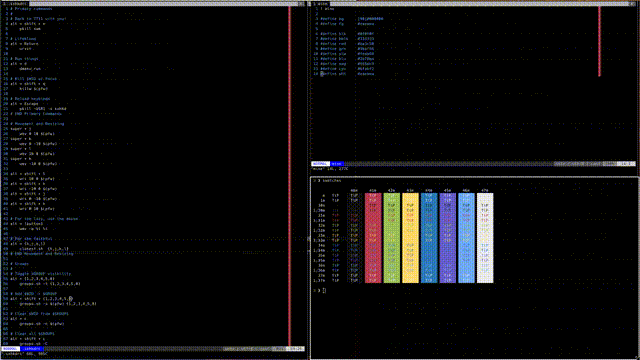

dotfiles
==========


## Description

> Config files that I use on all of my Linux systems.

> Example of my wmutils setup:



> Download [webm](wmutils.webm)


## Installation


> Install [GNU stow](), backup your current configs, then:

```
    $ git clone git@github.com:darhlukan/dotfiles.git ~/dotfiles
    $ cd dotfiles
    $ stow <dir>
```

> Replace ```<dir>``` with the directory name containing the configs you want to use.  For example, if you wanted to use
> the same terminal configuration as me, you would run:

```
    $ stow urxvt
```

> The above command will create symlinks for .Xresources, .Xdefaults, and .xres in your $HOME directory.

**IMPORTANT!: You will probably need to go through the configs and make sure to change any hardcoded paths.**
